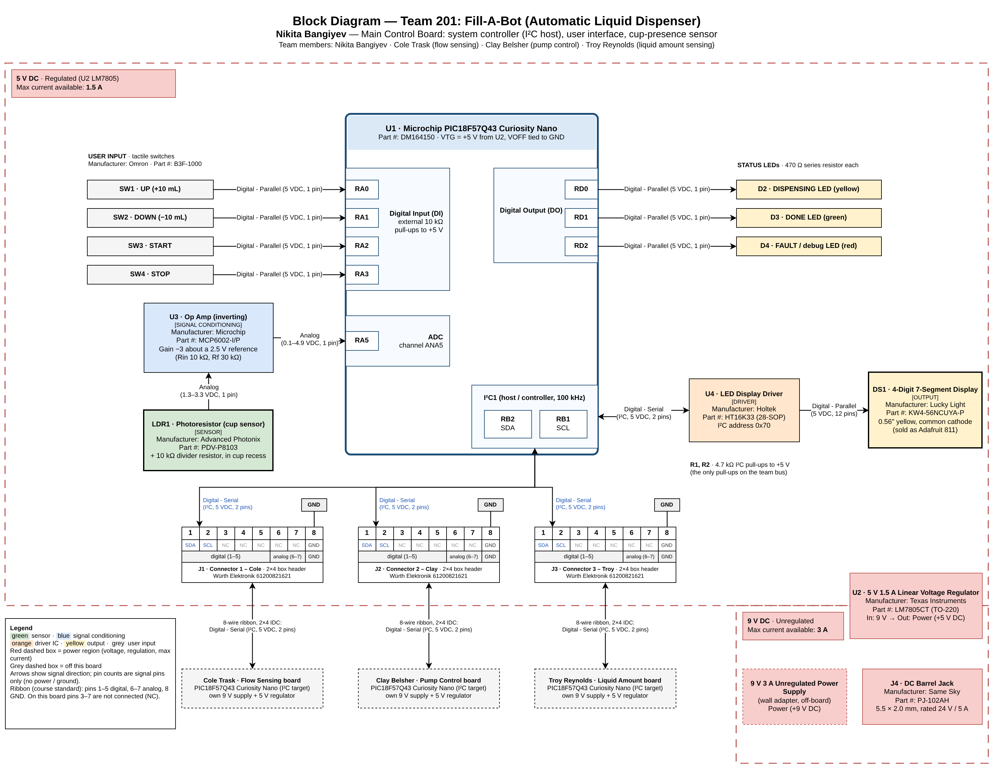

# Block Diagram

**Nikita Bangiyev** · Team 201 · Fill-A-Bot: Automatic Liquid Dispenser · EGR 304, Fall 2026

## Overview

My subsystem is the **main control board** for Fill-A-Bot. It is the I²C host for the team. It reads the user's buttons, tells Clay's pump board when to run, reads the dispensed amount from Cole's flow board and Troy's scale board, and shows the target and dispensed volume on a 4-digit display. My board also has its own sensor: a photoresistor under the cup spot, amplified by an op amp, so the pump can only start when a cup is in place.

- **Sensor:** photoresistor cup sensor (LDR1) with an inverting op-amp stage (U3), read by the ADC
- **Outputs:** 4-digit 7-segment display (DS1) through an HT16K33 driver (U4), plus three status LEDs
- **User input:** four push buttons (UP, DOWN, START, STOP)
- **Team connections:** three 8-pin ribbon connectors (J1 Cole, J2 Clay, J3 Troy) with I²C on pins 1–2 and ground on pin 8
- **Power:** 9 V 3 A wall adapter → barrel jack → LM7805 linear regulator → 5 V for the whole board

## Block Diagram

{ width="100%" }

*Figure 1: Individual block diagram of the main control board (click the image to enlarge it).* The editable draw.io source is saved in this repository: [nikita-block-diagram.drawio](nikita-block-diagram.drawio).

## Power

| Region | Voltage | Regulated? | Max current available | Source | Blocks in this region |
|---|---|---|---|---|---|
| 9 V | 9 V DC | No | 3 A | Wall adapter into J4 barrel jack | J4, input side of U2 |
| 5 V | 5 V DC | Yes (U2, LM7805) | 1.5 A | U2 output | U1 Nano (VTG), U3, U4, DS1, LDR1, buttons, LEDs, I²C pull-ups |

The Curiosity Nano is powered through its VTG pin with VOFF tied to GND, which is what the Nano user guide requires when an external supply is used. My estimated 5 V load is about 150 mA (the display is about 100 mA of that, worst case). That means U2 burns about (9 V − 5 V) × 0.15 A ≈ 0.6 W, which is roughly a 33 °C rise for a TO-220 at 54 °C/W, so no heat sink is needed.

## Microcontroller I/O

| Peripheral | Pin | Direction | Connects to | Signal |
|---|---|---|---|---|
| Digital Input (DI) | RA0 | In | SW1 UP button | Digital - Parallel (5 VDC, 1 pin) |
| Digital Input (DI) | RA1 | In | SW2 DOWN button | Digital - Parallel (5 VDC, 1 pin) |
| Digital Input (DI) | RA2 | In | SW3 START button | Digital - Parallel (5 VDC, 1 pin) |
| Digital Input (DI) | RA3 | In | SW4 STOP button | Digital - Parallel (5 VDC, 1 pin) |
| ADC (channel ANA5) | RA5 | In | U3 op-amp output (cup sensor) | Analog (0.1–4.9 VDC, 1 pin) |
| Digital Output (DO) | RD0 | Out | D2 Dispensing LED | Digital - Parallel (5 VDC, 1 pin) |
| Digital Output (DO) | RD1 | Out | D3 Done LED | Digital - Parallel (5 VDC, 1 pin) |
| Digital Output (DO) | RD2 | Out | D4 Fault / debug LED | Digital - Parallel (5 VDC, 1 pin) |
| I²C1 (host) | RB2 (SDA), RB1 (SCL) | Both | U4 HT16K33, J1, J2, J3 | Digital - Serial (I²C, 5 VDC, 2 pins) |

That is 10 signal pins total. All of them are on the Curiosity Nano edge connector and none are used by an on-board function (LED0 is RF3, SW0 is RB4, and the USB serial port uses RF0/RF1). RB1 and RB2 are the pins the Nano labels as I2C1 SCL and SDA, which are the same pins Clay and Troy use.

## Ribbon Connectors

The course standard is an 8-wire ribbon with 2×4 IDC connectors: pins 1–5 digital I/O, pins 6–7 analog I/O, pin 8 ground. My board has one connector per teammate.

| Pin | Course standard | J1 (Cole) | J2 (Clay) | J3 (Troy) | U1 pin | Direction |
|---|---|---|---|---|---|---|
| 1 | Digital I/O | SDA | SDA | SDA | RB2 | Both |
| 2 | Digital I/O | SCL | SCL | SCL | RB1 | Main → teammate |
| 3 | Digital I/O | NC | NC | NC | — | — |
| 4 | Digital I/O | NC | NC | NC | — | — |
| 5 | Digital I/O | NC | NC | NC | — | — |
| 6 | Analog I/O | NC | NC | NC | — | — |
| 7 | Analog I/O | NC | NC | NC | — | — |
| 8 | Ground | GND | GND | GND | GND | — |

The main board is the only I²C host. Each teammate board is an I²C target with its own unique address, which the team will set in the message structure. The HT16K33 on my board uses address 0x70. R1 and R2 (4.7 kΩ to 5 V) are the only pull-up resistors on the bus.

> **Note:** The current team block diagram shows +5 V on ribbon pin 4. The course standard says ribbon pins 1–7 have to connect to a microcontroller pin, and every board already has its own 9 V supply and 5 V regulator, so my board leaves pin 4 unconnected. The team diagram will be updated to match.

## Major Components

| Ref | Block | Manufacturer | Part number | Notes |
|---|---|---|---|---|
| U1 | Microcontroller | Microchip | PIC18F57Q43 Curiosity Nano (DM164150) | Required board, VTG = 5 V |
| U2 | 5 V linear regulator | Texas Instruments | LM7805CT (TO-220) | 1.5 A, needs at least 7.5 V in |
| J4 | DC barrel jack | Same Sky | PJ-102AH | 5.5 × 2.0 mm, rated 24 V / 5 A |
| LDR1 | Cup sensor (**sensor**) | Advanced Photonix | PDV-P8103 | CdS photoresistor with a 10 kΩ divider resistor |
| U3 | Op amp, inverting (**signal conditioning**) | Microchip | MCP6002-I/P | Gain −3 about a 2.5 V reference, rail-to-rail, 1.8–6 V supply |
| U4 | LED display driver (**driver**) | Holtek | HT16K33 (28-pin SOP) | I²C, 4.5–5.5 V supply |
| DS1 | 4-digit 7-segment display (**output**) | Lucky Light | KW4-56NCUYA-P | 0.56 in yellow, common cathode (sold as Adafruit 811) |
| SW1–SW4 | Push buttons (**user input**) | Omron | B3F-1000 | 10 kΩ pull-ups to 5 V |
| D2–D4 | Status LEDs (**output**) | — | yellow / green / red | 470 Ω series resistor each |
| J1–J3 | Ribbon connectors | Würth Elektronik | 61200821621 | 2×4 shrouded box header, 2.54 mm |

## Design Choices

- **Display driver on my board:** The display is a bare 7-segment display driven by an HT16K33 chip on my PCB, instead of an Adafruit display with an I²C backpack, because EGR 304 does not allow daughter boards. It shares the I²C bus, so it doesn't use any extra Nano pins.
- **Cup sensor as my analog sensor:** A photoresistor and a resistor alone only make a voltage divider, so I added an op-amp gain stage, which the course requires for an analog sensor. It is the same circuit as my photoresistor lab: about 0.1 V at the ADC with no cup and about 4.9 V with a cup covering the sensor.
- **No actuator on this board:** The pump is on Clay's board and gets its power there. My board only sends it on/off commands over I²C.
- **Proposed choices:** The button, LED and ADC pin assignments and the part numbers for the photoresistor, buttons, LEDs and connectors are my current picks and may change during component selection.

## How My Board Is Different From My Teammates'

| Teammate | Subsystem | Main sensing / actuation |
|---|---|---|
| Nikita Bangiyev (me) | Main control board | Photoresistor cup sensor with op amp, display driver and display, buttons, I²C host |
| Cole Trask | Flow sensing | Flow sensor |
| Clay Belsher | Pump control | Pump with MOSFET driver (actuator) |
| Troy Reynolds | Liquid amount sensing | Load cell with HX711 |

## References

1. Microchip Technology Inc., *PIC18F57Q43 Curiosity Nano Hardware User Guide*, DS40002186B. [Link](https://ww1.microchip.com/downloads/aemDocuments/documents/MCU08/ProductDocuments/UserGuides/PIC18F57Q43-Curiosity-Nano-HW-UserGuide-DS40002186B.pdf)
2. Texas Instruments, *LM340, LM340A and LM7805 Family Wide VIN 1.5-A Fixed Voltage Regulators*, SNOSBT0L. [Link](https://www.ti.com/lit/ds/symlink/lm340.pdf)
3. Holtek Semiconductor, *HT16K33 RAM Mapping 16×8 LED Controller Driver with Keyscan*, Rev. 1.10. [Link](https://cdn-shop.adafruit.com/datasheets/ht16K33v110.pdf)
4. Lucky Light Electronics, *KW4-56NXXX 0.56" Quadruple Digit Numeric Displays*. [Link](https://cdn-shop.adafruit.com/datasheets/811datasheet.pdf)
5. Microchip Technology Inc., *MCP6001/1R/1U/2/4 1 MHz, Low-Power Op Amp*, DS20001733L. [Link](https://ww1.microchip.com/downloads/en/DeviceDoc/MCP6001-1R-1U-2-4-1-MHz-Low-Power-Op-Amp-DS20001733L.pdf)
6. Advanced Photonix, *PDV-P8103 CdS Photoconductive Photocell*. [Link](https://media.digikey.com/pdf/data%20sheets/photonic%20detetectors%20inc%20pdfs/pdv-p8103.pdf)
7. Same Sky (formerly CUI Devices), *PJ-102AH DC Power Jack*, Datasheet. [Link](https://www.sameskydevices.com/product/resource/pj-102ah.pdf)
8. Omron Electronic Components, *B3F Tactile Switch*. [Link](https://components.omron.com/us-en/products/switches/B3F)
9. Würth Elektronik, *WR-BHD 2.54 mm Male Box Header*. [Link](https://www.we-online.com/en/components/products/WTB_WR_BHD_BOX_HEADER_2_54MM_MALE_PCB)
10. EGR 304, *Fall 2026 Project Description* and *EGR 304/314 Course Sequence Requirements*. [Link](https://embedded-systems-design.bitbucket.io/304/course-info/project-description/)
